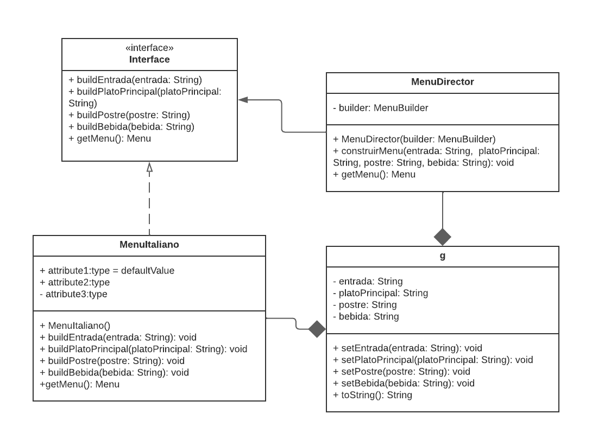
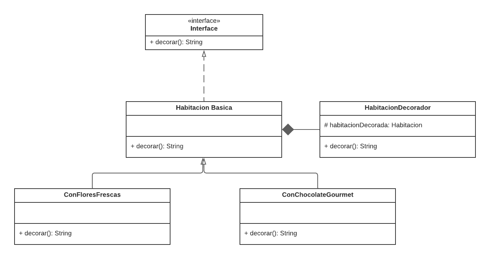
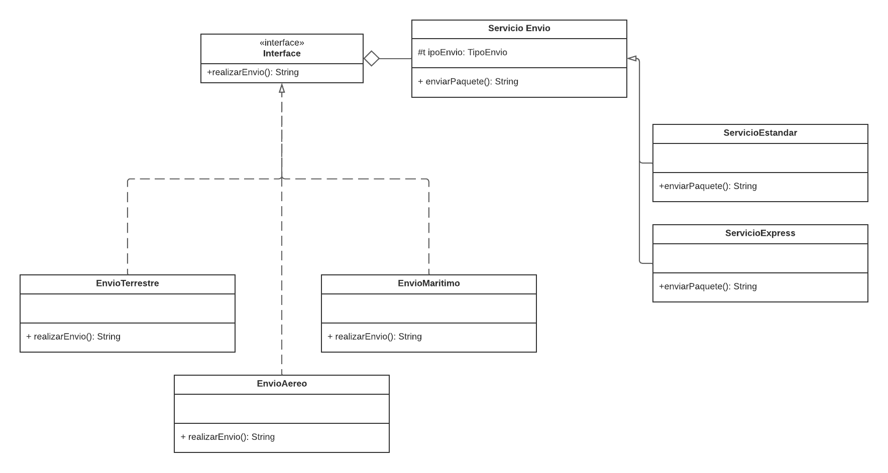

# Patrones-Diseño
Integrantes: Sebastián Castellanos & Sara Piraquive

1. Gestión Restaurante
   1. Patrón de comportamiento (Template Method): Se escogió este patrón porque define la estructura de un algoritmo en la clase base, permitiendo que las subclases implementen o sobrescriban pasos específicos, en este caso, los pasos de las órdenes de cada una de las subclases gestionRestaurante.OrderFood,gestionRestaurante.OrderBeverage,gestionRestaurante.OrderDessert.
   2. Diagrama de clases 
2. Gestión Tareas
   1. Patrón de comportamiento (Command): Se escogió este patrón porque convierte una solicitud en un objeto independiente, además permite mantener un historial de acciones ejecutadas. En este caso, el "ManagerTarea" mantiene una pila de comandos ejecutados, lo que permite deshacer la última acción realizada y restaurar el estado anterior del sistema.
   2. 
3. Construccion Restaurante
   1. Patrón de comportamiento (Builder): Se escogio este patron de diseño ya que se necesita construir objetos complejos y ademas se necesita la creacion de diferentes variantes de productos en este caso menus, ademas de permitir la mantenibilidad en el codigo y por ultimo la adicion de nuevos menus sin modificar el codigo existente.
   2. 
4. Decoracion Hotel
   1. Patron Estructural (Decorator): Se esocgio este patron ya que es el mas apropiado para este caso a que permite agregar nuevas funcionalidades a objetos existentes sin alterar su estructura, en este contexto se pueden añadir nuevas decoraciones, ademas de combinar decoraciones flexiblemente y ademas no cambia el comportamiento de la clase original, en conclusion es un sistema que se adapta a las necesidades del cliente.
   2. 
5. Sistema Envios
   1. Patron Estructural (Bridge): Se escogio este patron ya que desacopla la abstraccion de la implementacion y ademas facilita la extenisbilidad del sistema, esto con el proposito de manejar diversas combinaciones de envios y servicios y mantentiendo e codigo organizado.
   2. 