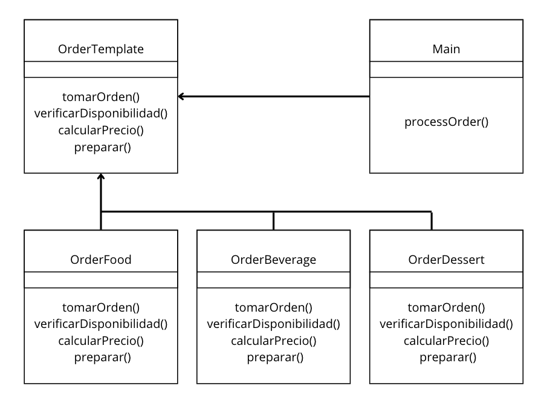
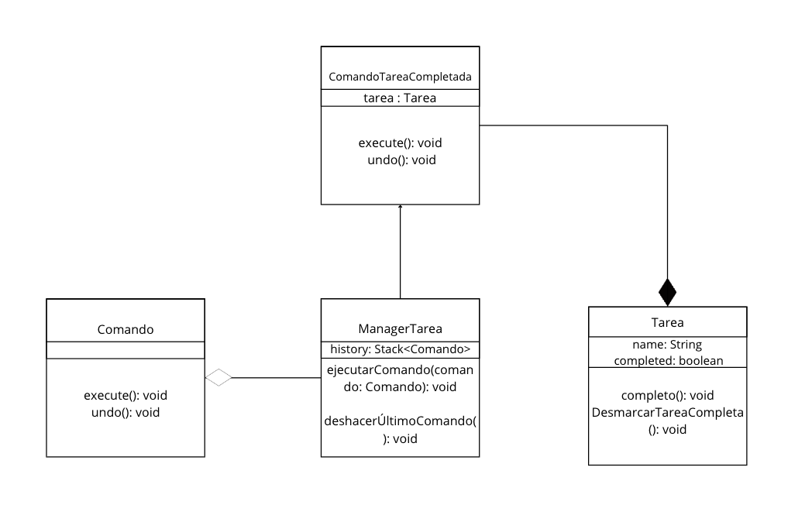

# Patrones-Diseño
Integrantes: Sebastián Castellanos & Sara Piraquive

1. Gestión Restaurante
   1. Patrón de comportamiento (Template Method): Se escogió este patrón porque define la estructura de un algoritmo en la clase base, permitiendo que las subclases implementen o sobrescriban pasos específicos, en este caso, los pasos de las órdenes de cada una de las subclases gestionRestaurante.OrderFood,gestionRestaurante.OrderBeverage,gestionRestaurante.OrderDessert.
   2. Diagrama de clases 
2. Gestión Tareas
   1. Patrón de comportamiento (Command) :Se escogió este patrón porque convierte una solicitud en un objeto independiente, además permite mantener un historial de acciones ejecutadas. En este caso, el "ManagerTarea" mantiene una pila de comandos ejecutados, lo que permite deshacer la última acción realizada y restaurar el estado anterior del sistema.
   2. 